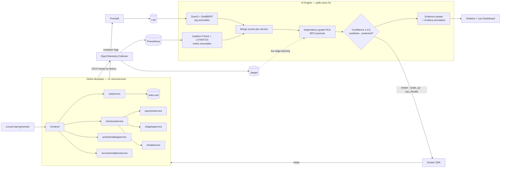

<div align="center">

# Self-Healing Infrastructure

### AI-Powered Autonomous Observability & Remediation

**Detect → Diagnose → Heal. In under 15 seconds. No human in the loop.**

<br/>

[](https://www.python.org/)
[](https://flask.palletsprojects.com/)
[](https://docs.docker.com/compose/)
[](https://scikit-learn.org/)
[](https://pytorch.org/)
[](https://huggingface.co/)

[](https://opentelemetry.io/)
[](https://prometheus.io/)
[](https://grafana.com/oss/loki/)
[](https://www.jaegertracing.io/)
[](https://grafana.com/)


[](LICENSE)


<br/>

[**Quick Start**](#quick-start) ·
[**Architecture**](#architecture) ·
[**AI Stack**](#the-ai-stack) ·
[**Remediation**](#autonomous-remediation) ·
[**Chaos Demo**](#chaos-demo) ·
[**API**](#api-reference) ·
[**Team**](#team)

</div>

---

## Why this exists

Traditional monitoring stops at **alerting**. A pager goes off, a human wakes up, reads dashboards, guesses the cause, and restarts something. That loop costs minutes — or hours — of downtime.

**Self-Healing Infrastructure closes the loop.** It watches a live microservice system through logs, metrics and traces, uses machine learning to spot anomalies, walks a dependency graph to find the *real* culprit (not just the loudest symptom), and then fixes it on its own — with a full audit trail explaining *why*.

> ### From passive monitoring → to autonomous operation.

---

## Highlights

| Capability | How |
|---|---|
| **Log anomaly detection** | Drain3 template mining → frequency-spike & new-pattern scoring → DistilBERT zero-shot re-scoring |
| **Metric anomaly detection** | Per-service Isolation Forest on latency / error-rate / throughput, plus an LSTM + TCN temporal model for gradual drift |
| **Graph-based root cause analysis** | BFS over a dependency graph that is **learned live from Jaeger traces**, with a known topology as fallback |
| **Autonomous remediation** | `restart`, `scale_up` and `cpu_throttle` via the Docker SDK, gated by confidence, cooldowns and protected-service rules |
| **Explainable by design** | Every action produces a structured *evidence packet*: what was detected, why, what was done, and how confident the system was |
| **Built-in chaos engineering** | One-click crash / CPU-stress / latency injection to watch the system heal in real time |
| **Zero labeled data** | Unsupervised + pretrained models only — it learns from live system behavior |
| **Safety net watchdog** | Background thread restarts any crashed container that produced no logs for the detectors to see |

---

## Architecture



### The detection cycle

Every cycle has a **hard 15-second budget**, tracked and reported per step.

| # | Step | Component | Budget |
|---|---|---|---|
| 1 | Fetch + analyze logs | Drain3 (+ DistilBERT) | ~100–200 ms |
| 2 | Fetch + analyze metrics | Isolation Forest (+ LSTM/TCN) | ~50 ms |
| 3 | Merge anomaly scores per service | Max-severity fusion | ~1 ms |
| 4 | Root cause analysis | BFS over dependency graph | ~10 ms |
| 5 | Remediation *(async, fire-and-forget)* | Docker SDK | dispatched instantly |
| 6 | Evidence packet + Grafana annotation | Explainability engine | ~55 ms |

Remediation runs on a background thread so slow Docker restarts never blow the cycle budget.

---

## The AI Stack

No labeled datasets. No hand-written alert thresholds per service. The system learns what "normal" looks like from the live system.

| Model | Signal | Role | Learning |
|---|---|---|---|
| **Drain3** | Logs | Online log template mining; flags *new templates*, *frequency spikes* (≥3× baseline) and *error bursts* | Unsupervised |
| **DistilBERT (NLI)** | Logs | Zero-shot re-scoring of Drain3-flagged templates as *service failure / performance degradation / normal operation* | Pretrained |
| **Isolation Forest** | Metrics | Per-service outlier detection over request rate, p50/p99/avg latency, error rate, throughput delta; retrains periodically | Unsupervised |
| **LSTM + TCN** | Metrics | Pure-NumPy temporal model (with a PyTorch variant) catching gradual drift that point-in-time detectors miss | Online, no labels |

**Two-stage log pipeline:** Drain3 acts as a fast pre-filter, so the heavier transformer only runs on templates that already look suspicious.

**Graceful degradation:** every ML component has a fallback. No transformer weights? Keyword severity scoring. No LSTM? Isolation Forest alone. Backends unreachable? Realistic simulated telemetry, so the system always demos.

---

## Root Cause Analysis

Services form a directed **dependency graph** (`A → B` means *A calls B*). When several services light up at once, the loudest one is usually just a victim.

```
 frontend  ──►  checkoutservice  ──►  cartservice  ──►  redis-cart
  (symptom)       (symptom)            (ROOT CAUSE)
```

1. Start from every anomalous service
2. **BFS** downstream through its dependencies
3. Anomalous dependencies become root-cause candidates
4. The **deepest, most severe** candidate wins
5. Confidence is computed from severity, graph depth and blast radius (number of dependents)

The graph is **bootstrapped from a known topology and continuously refined from live Jaeger traces** by a background thread — so it keeps learning even during healthy periods.

---

## Autonomous Remediation

The action is chosen by the *type* of anomaly, not hard-coded per service:

| Anomaly type | Action | What happens |
|---|---|
| `error_burst`, `new_template`, `error_rate`, `sudden_spike`, `multi_signal` | **restart** | Container restarted (or started, if already dead) |
| `latency_spike`, `throughput_anomaly`, `temporal_degradation` | **scale_up** | Extra replica launched (capped per service) |
| `frequency_spike`, `resource_saturation`, `gradual_drift` | **cpu_throttle** | CPU quota capped at 50% on the runaway container |

### Safety rails

Autonomy without guardrails is just an outage generator. Every action must pass:

| Guardrail | Value |
|---|---|
| **Confidence gate** | RCA confidence ≥ `0.6` or no action is taken |
| **Cooldown** | 60 s per service — no restart storms |
| **Blast-radius cap** | Max 2 actions per cycle, max 2 replicas per service |
| **Protected services** | `prometheus`, `loki`, `jaeger`, `otel-collector`, `grafana`, `ai-engine`, `locust` are never touched |
| **Container watchdog** | Independent 30 s loop restarts crashed app containers and prunes stale replicas |

### Explainable evidence packets

Every cycle with anomalies emits a structured packet, served at `/api/incidents` and annotated on Grafana:

```
incident_id · cycle_timestamp
├── detection     what was detected, with sample logs, trace IDs and contributing metrics
├── root_cause    causal chain, graph depth, confidence
├── remediation   action, target, status, execution time
├── timing        per-step latency vs. the 15 s budget
└── outcome       result tracking
```

---

## Quick Start

**Prerequisites:** Docker + Docker Compose, ~4 GB free RAM, and a few minutes for the first build (PyTorch + model download).

```bash
# 1. Clone
git clone https://github.com/<your-username>/self-healing-infrastructure.git
cd self-healing-infrastructure

# 2. Launch the entire stack (microservices + observability + AI engine + load generator)
docker compose up --build -d

# 3. Watch the AI engine think
docker compose logs -f ai-engine
```

### Where to look

| Service | URL | What it is |
|---|---|
| **AI Live Dashboard** | http://localhost:8000 | Real-time RCA, incidents, dependency graph and the chaos button |
| **Grafana** | http://localhost:3000 | Error rate, latency, throughput, logs and AI cycle-time vs. the 15 s budget |
| **Online Boutique** | http://localhost:8080 | The demo e-commerce app being protected |
| **Jaeger** | http://localhost:16686 | Distributed traces |
| **Prometheus** | http://localhost:9090 | Raw metrics |
| **Locust** | http://localhost:8089 | Load generator (simulated shoppers) |

---

## Chaos Demo

The best way to understand the system is to break it.

1. Open the **AI Live Dashboard** at http://localhost:8000
2. Pick a service and a failure mode, then press the chaos button
3. Watch detection → RCA → remediation unfold on the dashboard

Or from the terminal:

```bash
curl -X POST http://localhost:8000/api/chaos \
  -H "Content-Type: application/json" \
  -d '{"service": "cartservice", "mode": "crash"}'
```

| Mode | What it does | Expected AI response |
|---|---|
| `crash` | `SIGKILL` the container | Detects error burst → **restart** |
| `stress` | Spins CPU burners inside the container | Detects resource saturation → **cpu_throttle** |
| `latency` | Injects 500 ms network delay (`tc netem`) | Detects latency spike → **scale_up** |

Chaos is blocked for protected infrastructure services.

---

## API Reference

The AI engine exposes a small Flask API on port `8000`.

| Method | Endpoint | Description |
|---|---|
| `GET` | `/` · `/dashboard` | Live dashboard UI |
| `GET` | `/health` | Health check (used by Docker) |
| `GET` | `/metrics` | Prometheus exposition: last cycle time and cycle count |
| `GET` | `/api/status` | Engine stats: cycles, anomalies, remediations, per-component stats |
| `GET` | `/api/incidents?count=10` | Recent evidence packets |
| `GET` | `/api/graph` | Current dependency graph |
| `GET` | `/api/chaos/services` | Services and modes available for chaos injection |
| `POST` | `/api/chaos` | Inject a failure `{"service": "...", "mode": "crash\|stress\|latency"}` |

---

## Configuration

Set via environment variables on the `ai-engine` service in `docker-compose.yml`:

| Variable | Default | Description |
|---|---|
| `POLL_INTERVAL` | `5` | Seconds between detection cycles |
| `LOKI_URL` | `http://loki:3100` | Log backend |
| `PROMETHEUS_URL` | `http://prometheus:9090` | Metrics backend |
| `JAEGER_URL` | `http://jaeger:16686` | Trace backend (dependency learning) |
| `GRAFANA_URL` | `http://grafana:3000` | Where annotations are posted |
| `LOG_LEVEL` | `INFO` | `DEBUG` for verbose logging |

---

## Project Structure

```
self-healing-infrastructure/
├── ai_engine/
│   ├── ai_engine.py            # Orchestrator: poll loop, API, chaos, watchdog
│   ├── drain_detector.py       # Drain3 log anomaly detection
│   ├── bert_log_classifier.py  # DistilBERT zero-shot log re-scoring
│   ├── metric_detector.py      # Isolation Forest metric detection
│   ├── lstm_detector.py        # LSTM + TCN temporal degradation model
│   ├── dependency_graph.py     # Trace-learned graph + BFS root cause analysis
│   ├── remediation_engine.py   # Docker SDK actions + safety gating
│   ├── explainability.py       # Evidence packets + Grafana annotations
│   ├── dashboard.html          # Live dashboard UI
│   ├── Dockerfile
│   └── requirements.txt
├── grafana/                    # Provisioned datasources + AI observability dashboard
├── prometheus/                 # Scrape config
├── loki/                       # Log storage config
├── promtail/                   # Log shipping config
├── otel-collector-config.yaml  # OpenTelemetry pipeline
├── locust/locustfile.py        # Realistic shopper traffic
└── docker-compose.yml          # The whole system, one command
```

---

## Tech Stack

| Layer | Technologies |
|---|---|
| **Language & API** | Python 3.11, Flask |
| **ML / AI** | Drain3, scikit-learn (Isolation Forest), PyTorch + Hugging Face Transformers (DistilBERT), NumPy (LSTM/TCN) |
| **Telemetry** | OpenTelemetry Collector, Prometheus, Loki + Promtail, Jaeger |
| **Visualization** | Grafana 10, custom live dashboard |
| **Remediation** | Docker SDK for Python |
| **Target app** | Google Online Boutique microservices demo |
| **Load & chaos** | Locust, built-in chaos injection |
| **Packaging** | Docker, Docker Compose |

---

## Security Note

To remediate containers, the AI engine mounts the Docker socket (`/var/run/docker.sock`) and Grafana is configured with anonymous admin access. **This is a demo configuration** — do not expose it to untrusted networks. See below for hardening in production.

---

## Scaling to Production

This implementation targets Docker Compose for demonstration and low-latency response. The architecture extends naturally to production:

-  **Kubernetes** — swap the Docker SDK for the Kubernetes API (rollout restart, HPA) and scale actions across nodes
-  **Kafka / streaming ingestion** — replace polling with streaming log and metric pipelines
-  **Distributed inference** — shard per-service models across workers
-  **GPU model serving** — drop in a CUDA build of PyTorch (one line in `requirements.txt`)
-  **Least-privilege remediation** — replace the raw Docker socket with a scoped control plane and approval workflows for high-risk actions

---

## What makes it different

Most observability tools do **one** of detection, diagnosis or remediation. This project unifies all three into a single closed loop:

- **Multi-signal** — logs, metrics *and* traces feed one decision
- **Causal, not correlational** — a dependency graph finds the root cause instead of treating every alert equally
- **Autonomous but accountable** — every action is gated, rate-limited and explained
- **Label-free** — works on day one, learns from live behavior

---

## Team

<table>
  <tr>
    <td align="center"><b>Dhruv Mahajan</b></td>
    <td align="center"><b>Tarun Singh</b></td>
    <td align="center"><b>Puranjay Rajput</b></td>
    <td align="center"><b>Sukhleen Singh Virk</b></td>
  </tr>
</table>

---

## License

Distributed under the **MIT License**. See [`LICENSE`](LICENSE) for details.

---

## Acknowledgements

[Google Online Boutique](https://github.com/GoogleCloudPlatform/microservices-demo) · [Drain3](https://github.com/logpai/Drain3) · [OpenTelemetry](https://opentelemetry.io/) · [Grafana Labs](https://grafana.com/) · [Jaeger](https://www.jaegertracing.io/) · [Hugging Face](https://huggingface.co/)

<div align="center">

<br/>

** If this project helped or inspired you, give it a star! **

*Built so your 3 AM pager can stay silent.*

</div>
